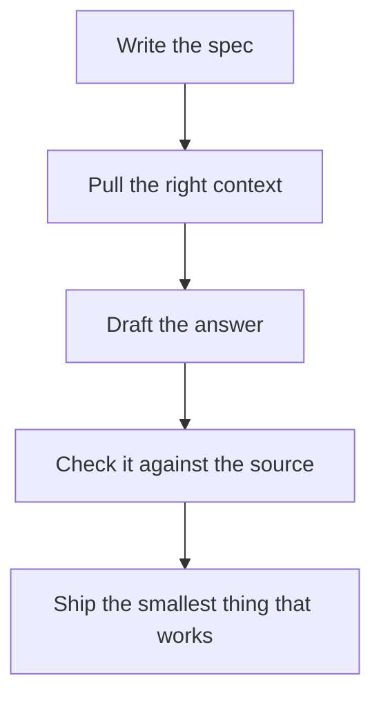

<p align="center">
  <picture>
    <source media="(prefers-color-scheme: dark)" srcset="https://readme-typing-svg.demolab.com?font=Fira+Code&weight=500&size=22&duration=2800&pause=900&color=58A6FF&center=true&vCenter=true&width=720&height=50&lines=AI+engineer+in+Hyderabad;Language+models%2C+vision%2C+and+edge+AI;Retrieval%2C+agents%2C+and+OCR;I+also+build+games+on+the+side" />
    
  </picture>
</p>

<p align="center">
  <a href="https://harshit-portfolio-d3b1.vercel.app/"></a>
  <a href="https://www.linkedin.com/in/YOUR-LINKEDIN"></a>
  <a href="mailto:YOUR-EMAIL"></a>
</p>

## About

I'm Harshit. I live in Hyderabad.

I'm an AI engineer. Most days that means language models, retrieval, and agents that can check their own work. I also work on computer vision, and on models that have to run on the device, not only in the cloud. I make games when I get a spare week.

## Model card

| | |
| --- | --- |
| Name | Harshit |
| Role | AI engineer |
| Location | Hyderabad, India |
| Focus | LLMs, RAG, multi-agent systems, computer vision, edge AI |
| Portfolio | [harshit-portfolio-d3b1.vercel.app](https://harshit-portfolio-d3b1.vercel.app/) |

## How I build



## Now

```yaml
now:
  base: Hyderabad
  building:
    - retrieval and agents
    - vision and OCR
    - models that run on device
  side: games
```

## Stack

<p align="center">
  <picture>
    <source media="(prefers-color-scheme: dark)" srcset="https://skillicons.dev/icons?i=python,ts,js,fastapi,react,nodejs,express,postgres,docker,redis,git,githubactions&theme=dark" />
    
  </picture>
</p>

## Work

| Project | What it does |
| --- | --- |
| [must_agent](https://github.com/Got950/must_agent) | Routes a task across agents, scores priority, recalls Chroma memory, and critiques the answer |
| [Anchor](https://github.com/Got950/Anchor) | Answers support questions from product docs and tickets, with a chat UI and an eval harness |
| [Email-Generation-Assistant](https://github.com/Got950/Email-Generation-Assistant) | Writes an email with a role, examples, and a self-check, then scores it on three metrics |
| [ocr-evaluator](https://github.com/Got950/ocr-evaluator) | Reads handwritten exam PDFs and grades text, numeric, and symbolic answers |
| [crime-risk-agent](https://github.com/Got950/crime-risk-agent) | Scores a property's security risk from the address, the property, and city crime data |
| [Personal_Voice_Bot](https://github.com/Got950/Personal_Voice_Bot) | Voice chat as Alex, through Groq, with a person profile you can edit |

## Stats

<p align="center">
  <picture>
    <source media="(prefers-color-scheme: dark)" srcset="https://github-readme-stats.vercel.app/api?username=Got950&show_icons=true&hide_border=true&bg_color=0d1117&title_color=e6edf3&text_color=8b949e&icon_color=58a6ff&include_all_commits=true" />
    
  </picture>
  <picture>
    <source media="(prefers-color-scheme: dark)" srcset="https://streak-stats.demolab.com?user=Got950&hide_border=true&background=0D1117&ring=1F6FEB&fire=58A6FF&currStreakLabel=E6EDF3&sideLabels=8B949E&currStreakNum=E6EDF3&sideNums=E6EDF3&dates=8B949E" />
    
  </picture>
</p>

<p align="center">
  <picture>
    <source media="(prefers-color-scheme: dark)" srcset="https://github-readme-stats.vercel.app/api/top-langs/?username=Got950&layout=compact&hide_border=true&bg_color=0d1117&title_color=e6edf3&text_color=8b949e&langs_count=6" />
    
  </picture>
</p>

## Contact

[Portfolio](https://harshit-portfolio-d3b1.vercel.app/) · [LinkedIn](https://www.linkedin.com/in/YOUR-LINKEDIN) · [Email](mailto:YOUR-EMAIL)
