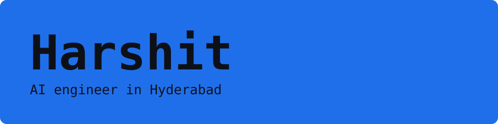
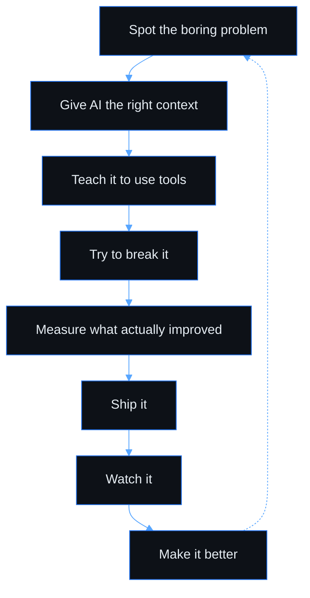

<p align="center">
  <a href="https://harshit-portfolio-d3b1.vercel.app/">Portfolio</a>
  &nbsp;&nbsp;·&nbsp;&nbsp;
  <a href="https://www.linkedin.com/in/YOUR-LINKEDIN">LinkedIn</a>
  &nbsp;&nbsp;·&nbsp;&nbsp;
  <a href="mailto:YOUR-EMAIL">Email</a>
</p>

## About

Most days I work on language models, retrieval, and agents that can check their own work. I also do computer vision, and models that have to run on the device, not only in the cloud. Games are a side project.

## How I build



## Now

```yaml
now:
  base: Hyderabad
  building:
    - retrieval and agents
    - vision and OCR
    - models that run on device
  side: games
```

## Stack

<p align="center">
  <picture>
    <source media="(prefers-color-scheme: dark)" srcset="https://skillicons.dev/icons?i=python%2Cts%2Cjs%2Chtml%2Ccss%2Cfastapi%2Creact%2Cnextjs%2Ctailwind%2Cvite%2Cnodejs%2Cexpress%2Cpostgres%2Cmongodb%2Credis%2Cdocker%2Cpytorch%2Csklearn%2Csupabase%2Cthreejs%2Caws%2Cterraform%2Cgithubactions%2Cvercel&theme=dark&perline=12" />
    
  </picture>
</p>

<p align="center">LangChain, OpenAI, Groq, Gemini, Chroma, sentence-transformers, Streamlit, Celery, SQLAlchemy, Clerk, n8n</p>

## Things I worked on

| Project | What it does |
| --- | --- |
| [must_agent](https://github.com/Got950/must_agent) | Routes a task across agents, scores priority, recalls Chroma memory, and critiques the answer |
| [Anchor](https://github.com/Got950/Anchor) | Answers support questions from product docs and tickets, with a chat UI and an eval harness |
| [Email-Generation-Assistant](https://github.com/Got950/Email-Generation-Assistant) | Writes an email with a role, examples, and a self-check, then scores it on three metrics |
| [ocr-evaluator](https://github.com/Got950/ocr-evaluator) | Reads handwritten exam PDFs and grades text, numeric, and symbolic answers |
| [crime-risk-agent](https://github.com/Got950/crime-risk-agent) | Scores a property's security risk from the address, the property, and city crime data |
| [Personal_Voice_Bot](https://github.com/Got950/Personal_Voice_Bot) | Voice chat as Alex, through Groq, with a person profile you can edit |
| [GulfDrive](https://github.com/Got950/GulfDrive) | Car marketplace for the GCC, with on-road price and EMI counted in Postgres |
| [AutoIq](https://github.com/Got950/AutoIq) | Turns a VIN into one dossier: specs, recalls, complaints, and a risk note |
| [Procurement-Module](https://github.com/Got950/Procurement-Module) | MedFlow, for pharma buying: roles, indents, and a copilot |
| [MCQ-Extractor](https://github.com/Got950/MCQ-Extractor) | Pulls multiple-choice questions out of academic PDFs |
| [N8N_automation](https://github.com/Got950/N8N_automation) | Watches Honda listings, checks NHTSA recalls, and posts a briefing to Discord |
