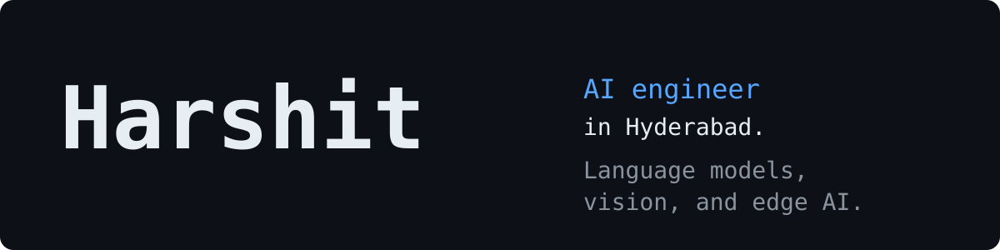

**A**

**B**

**C**

  <picture>
    <source media="(prefers-color-scheme: dark)" srcset="https://readme-typing-svg.herokuapp.com?font=Fira+Code&weight=500&size=22&duration=2800&pause=900&color=A5B4FC&center=true&vCenter=true&width=620&height=50&lines=AI+Engineer+based+in+Hyderabad;LLMs+%C2%B7+Computer+Vision+%C2%B7+Edge+AI;RAG%2C+multi-agent+systems%2C+and+OCR;I+also+build+games+on+the+side" />
    
  </picture>

  
  
  

## About Me

I'm Harshit, an AI engineer in Hyderabad, India. I work across AI, hardware, and software, and I build production AI products: retrieval-augmented generation, multi-agent systems, OCR, and edge AI. Game development is a side interest.

Portfolio: [harshit-portfolio-d3b1.vercel.app](https://harshit-portfolio-d3b1.vercel.app/)

## Tech stack

**Languages**

**AI / ML**

**Backend / Frontend**

**Tools**

## Featured projects

| Project | What it does |
| --- | --- |
| [must_agent](https://github.com/Got950/must_agent) | Multi-agent command center that routes a task, scores priority, recalls Chroma memory, critiques the answer, and writes an audit trail |
| [Email-Generation-Assistant](https://github.com/Got950/Email-Generation-Assistant) | Writes a professional email from intent, facts, and tone, then scores fact recall, tone, and writing quality |
| [ocr-evaluator](https://github.com/Got950/ocr-evaluator) | Reads handwritten exam PDFs with OCR and grades text, numeric, symbolic, and mixed answers |
| [crime-risk-agent](https://github.com/Got950/crime-risk-agent) | Scores a property's security risk from its address, characteristics, and city crime data |
| [Employee-Salary-Calculator](https://github.com/Got950/Employee-Salary-Calculator) | Manages employees and computes gross salary, a 10% tax, and net salary on the server |
| [Personal_Voice_Bot](https://github.com/Got950/Personal_Voice_Bot) | Voice chatbot that answers as Alex, using Groq and a person profile you can edit |

## GitHub stats

  <picture>
    <source media="(prefers-color-scheme: dark)" srcset="https://github-readme-stats.vercel.app/api?username=Got950&show_icons=true&theme=tokyonight&hide_border=true&bg_color=0d1117&include_all_commits=true" />
    <source media="(prefers-color-scheme: light)" srcset="https://github-readme-stats.vercel.app/api?username=Got950&show_icons=true&theme=default&hide_border=true&bg_color=ffffff&title_color=1a1b27&text_color=1a1b27&icon_color=7aa2f7&include_all_commits=true" />
    
  </picture>
  <picture>
    <source media="(prefers-color-scheme: dark)" srcset="https://github-readme-streak-stats.herokuapp.com/?user=Got950&theme=tokyonight&hide_border=true&background=0D1117" />
    <source media="(prefers-color-scheme: light)" srcset="https://github-readme-streak-stats.herokuapp.com/?user=Got950&theme=default&hide_border=true&background=FFFFFF&ring=7aa2f7&fire=7aa2f7&currStreakLabel=1a1b27&sideLabels=1a1b27&dates=6b7280&currStreakNum=1a1b27&sideNums=1a1b27" />
    
  </picture>

  <picture>
    <source media="(prefers-color-scheme: dark)" srcset="https://github-readme-stats.vercel.app/api/top-langs/?username=Got950&layout=compact&theme=tokyonight&hide_border=true&bg_color=0d1117&langs_count=8" />
    <source media="(prefers-color-scheme: light)" srcset="https://github-readme-stats.vercel.app/api/top-langs/?username=Got950&layout=compact&theme=default&hide_border=true&bg_color=ffffff&title_color=1a1b27&text_color=1a1b27&langs_count=8" />
    
  </picture>

## Contribution snake

The animation is generated daily by [`.github/workflows/snake.yml`](.github/workflows/snake.yml) and published on the `output` branch. It shows up after the first successful run.

  <picture>
    <source media="(prefers-color-scheme: dark)" srcset="https://raw.githubusercontent.com/Got950/Got950/output/github-contribution-grid-snake-dark.svg" />
    <source media="(prefers-color-scheme: light)" srcset="https://raw.githubusercontent.com/Got950/Got950/output/github-contribution-grid-snake.svg" />
    
  </picture>

